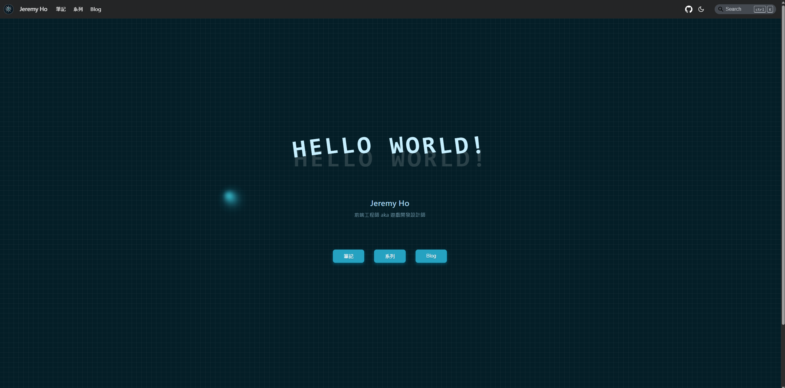

早在 2023 年我用 Docusaurus 第一次建了 CodeFictionist 這個部落格時，我就寫過一篇 Why Docusaurus 的文章。  
現在隨著這次我更動整個自己個人網站的架構，基本上是起了一個新的 Docusaurus 專案，在這整個重構與搬運文章的過程不免又會回顧一下過去的自己，雖然沒有細數，但數十篇文章也是紀錄著我兩年來的成長與變化。  
隨著新站 **Jeremy Ho* 上線、舊站  **CodeFictionist** 下架，我覺得是到了一個新的里程碑，重新寫一篇 Why Docusaurus 紀錄新站的誕生。

{/* truncate */}

## 我在網路上留下的第一篇紀錄
不算 FB 那些社群媒體，我第一次抱著想要把知識傳下去的心情認真寫一篇文章是在 2019 年我考上台大研究所時。  
那時寫那篇的初衷是我在備考時深感到網路上資源之不足，許多東西都無從準備起，更何況 2019 年是一個 AI 還未崛起的年代，那時是靠著已經在台大就讀的學姊推薦書籍以及各種從實驗室薅書來讀才得以好好準備。  

備考期間我也很喜歡看看 PTT 或 Dcard 上大家準備研究所的考試心得，我發現一些考上的人都會不吝於在網路上留下足跡，分享自己的經驗與書單，這無疑是幫助了許多後來者。  
但，農藝的圈子在那時幾乎沒這種人，因此我那時在考上後沒多久就撰寫了一篇心得文並創了 Blogger 分享在那上面。  
後來歷經了數個 blog 平台，現在那篇定居在這裡了 - [農藝所考試心得](../農藝所考試心得.mdx)。

## 寫文章的理由
隨著我人生時期的不同，寫文章的理由也不斷改變。  
我覺得 2019 到 2025 這段期間，雖然看似短短 6 年，但卻是我目前人生中個人變動最多的一段時期 - 從愛玩的大學生到台大研究所、研究所到出社會、FMCG 產業到前端工程師，太多的改變發生這時期，隨著想說的事情不同，寫文章的理由也不同。

因何而寫文章？  
即使已經讀過陳立飛先生的著作這麼久，我還是很推崇它的那本《寫作，是最好的自我投資》，自我投資就是最好的原因，即使出發點在每一個時期都不一樣。  
我第一篇文章是為了把考研的心得與書單分享給那些後來需要準備的人 (那幾年陸續有幾人寫信來給我，我深感感激)，接著陸續看了幾本書後開始寫一些讀書心得，甚至還發過一些關於農藝的文章，然後就沒然後了，接下來就斷了一個時期再也沒寫過文章。  
我反思那段時間是把自己當「商品」的慾望不夠強烈，對於寫作的熱情因此也無法持續，現在想來，著實有些可惜了，那可是段適合揮毫提筆、肆意青春的日子。

一直到 2023 年，那年也是挺波瀾壯闊的，我始終記得我 228 連假最後一天傳 Line 給當時公司的主管跟她說我不幹了，明天就想走行不行？很高興，我和平離職。  
在那之後我跟朋友一同去環島一圈後開始了我的轉職生涯 - 我花了將近 9 個月的時期上課，開始我的前端人生。  
那時上課時，Alpha Camp (不幸地，他們已經停止營運了) 的助教就很鼓勵我們寫文章，當作是一種筆記，同時因為是抱持著寫給「其他人」看的心情，會更加仔細地在腦中琢磨過那些要寫出來的字句，知識會更加牢固地銘刻在腦中。  
我相當同意當時助教的說法，又想到當初陳立飛先生那本著作，我覺得能當筆記還能順便宣傳自己著實是個 good idea，所以我在 Vocus 開了一個新站，開始著手寫一些關於程式的文章。  
我得說，這樣的心態從 2023 年就這樣持續到了今天，作為筆記的效果是真的挺不錯的，有一些技術稍微忘記的時候，網路上輸入一下自己網站的網址立馬可以複習真的挺方便的，但宣傳自己嘛，我只能說指日可待 XD

## Why Docusaurus?
既然文章標題是 **Why Docusaurus**，我當然要來說說為何我後來選擇 Docusaurus 作為我的部落格平台。  
從前面可以知道我的寫作平台一開始是 Google Blogger，接著是 Vocus，最後才是 Docusaurus。

其實作為一個前端工程師，我剛拿到第一份正職時是很有雄心壯志的！那時我想用 React 純手刻一個自己的部落格，然後那時的我其實連 Next 都不會，真搞不懂哪裡來的雄心壯志。  
後來是在不斷 survey 的過程中加上跑去學 AWS，發現一件很嚴重的事 - 寫文章需要儲存空間對吧，儲存空間哪裡來？  
不管是 AWS 還是 GCP 都不是那麼價格親民餒 (對當時第一份前端工作薪水只有 37000 的我來說)，就算是我後來愛用的 Vercel，免費的 Progress 也只提供 5G (但我還是感恩戴德地用著)。  
後來我開始去看其他有在寫部落格的前端前輩們都在哪裡寫文章，拋棄那些限制很多的已知著名平台，當我決定用 Hexos 時，我逛到了 [PJCHENder 的網站](https://pjchender.dev/)，我驚為天人，這種排版格式正是我喜歡的文章排版格式，看了一下是用 Docusaurus 寫的，於是開始研究 Docusaurus。  
研究了一番之後，發現文章其實是放在自己 repo 中的，完美解決了儲存空間的問題，加上 markdown 格式的文章也讓我可以很輕鬆地寫文章，於是我就決定用 Docusaurus 了。

## CodeFictionist 到 Jeremy Ho
我一開始建好的 Docusaurus 網站當時我命名為 CodeFictionist，在 Ganti 買的網域是用 `codefictionist.com` 這樣高端霸氣的域名。  
這個名字取自於我當時想要邊寫一些程式的文章又期許自己寫一些小說的野心，後來我發現我根本不會寫小說 XD  
CodeFictionist 從 2023 年一直用到 2025 年 04 月 20 日正式被我下架，Jeremy Ho 正式上線，至此我的網域改成了更具個人特色的 `jeremyho.tw`。

重新起一個專案的原因我思來想去其實就只是一種前端工程師的不滿足吧。  
我在某一天和同事聊到 blog 時，理所當然聊到 Docusaurus，那時我順手 google 了一下跟 Docusaurus 有關的網站，發現一位 [Bosh 前輩的網站](https://notes.boshkuo.com/)在 Docusaurus 關鍵字搜尋的分頁中排很前面，我就點進去看了，發現一樣是 Docusaurus 寫的網站，他的網站充滿了現代感與美感呀！  
因此我開始去他的 repo 中研究那些設定，看到那簡潔的設定、程式撰寫風格，我覺得，人家可以搜尋排行這麼前面不是沒理由的哈。  
回到我自己的 repo，我下定決心另起爐灶，用 TS 以及學習 Bosh 前輩用更適合維護的方式來建 Jeremy Ho 這個網站。

## 所以這不是一篇 Docusaurus 介紹文？
當然不是 XD  
要看介紹文可以去看筆記那裡 [Docusaurus 相關的文章](https://jeremyho.tw/docs/category/docusaurus)。  
如最一開始說的，這其實是一篇紀錄文而已，刻里程碑的意義遠大於使用 Docusaurus 的理由。  

我會繼續寫下去，這對我來說已經是一種我的資本了。  
期許著一天，有人可以寫信跟我說：Jeremy，你寫得真好！可以請你來跟我們做分享嗎？  
我肯定會開心到跳起來。

## 歷代網站
紀念一下那些各代網站的痕跡，部分網址換過了但就別在意了 XD

1. [Journal of Jeremy's Adventure](https://agjeremy.blogspot.com/?fbclid=IwY2xjawJ4aypleHRuA2FlbQIxMABicmlkETEzWHczRWE1Q3BLeWFGUEZDAR5wRAhyvOLyXf_fbI3s1zyMil1uU72I0TfW00iZmVtuFQ7y2jjk9xKrwixmyQ_aem_vM_Lb9O49V3PtFp5MYwFTQ)
2. [Vocus](https://vocus.cc/user/@Jeremy_Ho)
3. [CodeFictionist](https://codefictionist.vercel.app/)

順便給大家看看 CodeFictionist 跟 Jeremy Ho 的差異到底有多大 XD  

- 
- 

瞧瞧我連滑鼠都玩出新花樣了 XD