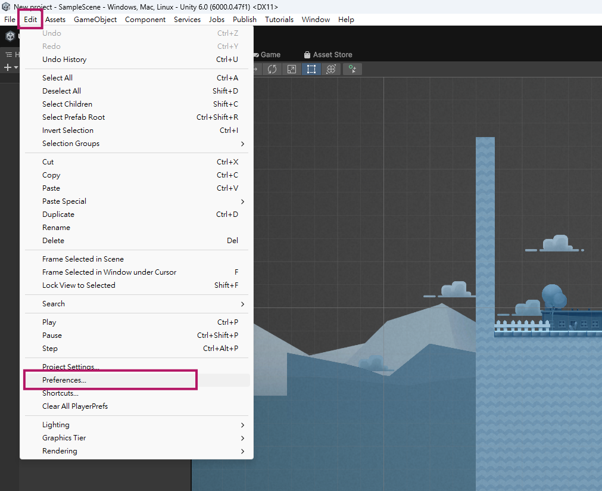
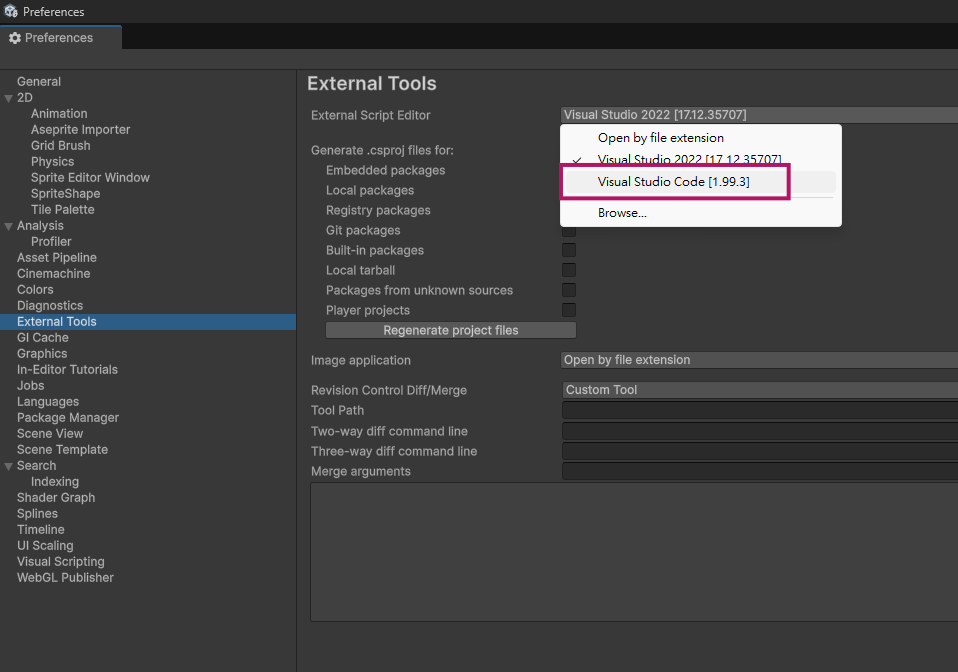
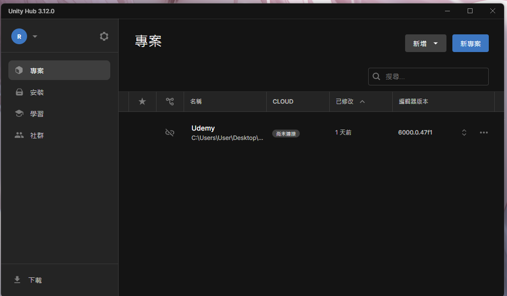

## Unity 安裝
[Unity 官網](https://unity.com/products) 下載 Unity Personal 版本 (免費版)。

1. 打開 Unity Hub，點選 **Installs** 頁籤，點選 **Install Editor** 按鈕，選擇要下載的 Unity 版本 (我撰寫時是採用 6.0 LTS)。
    - (optional) Microsoft Visual Studio 2022：如果打算以 Visual Studio 作為 IDE 的話，建議在這邊就一起安裝。
    - WebGL build support：如果打算開發 WebGL 的話，建議在這邊就一起安裝。
2. **Install** 按鈕開始安裝。

:::info
WebGL build support 是 Unity 的一個功能，可以讓我們將遊戲編譯成 WebGL 格式，這樣就可以在瀏覽器中運行遊戲了。
:::

### 用 Vscode 開發 Unity
雖然 C# 主流是以 Visual Studio 為主，但其實 VScode 的開發介面我比較習慣，所以改以 VScode 為主。

1. 先在 Unity Hub 建立一個新的 Unity 專案，我們需要先能進去 Unity 編輯器才能做 VScode 相關設定。
2. `Edit > Preferences > External Tools`，在 External Script Editor 選擇 VScode。

  


3. [下載 .Net](https://dotnet.microsoft.com/zh-tw/download)
4. 安裝 Vscode extension：
    - [C# Dev Kit](https://marketplace.visualstudio.com/items/?itemName=ms-dotnettools.csdevkit)：VScode 支援 C# 的擴充套件。
    - [C#](https://marketplace.visualstudio.com/items/?itemName=ms-dotnettools.csharp)：裝了 C# Dev Kit 之後其實就會被自動安裝了。
    - [Unity Code Snippets](https://marketplace.visualstudio.com/items/?itemName=kleber-swf.unity-code-snippets)：提供各種 Unity 常用語法的快速模板。
    - [Unity](https://marketplace.visualstudio.com/items/?itemName=VisualStudioToolsForUnity.vstuc)：VScode 支援 Unity 的擴充套件。
    - [.NET Install Tool](https://marketplace.visualstudio.com/items/?itemName=ms-dotnettools.vscode-dotnet-runtime)：裝了 C# Dev Kit 之後應該默認也會自動安裝。

## Unity 專案建立與版本控制
### 2D 專案建立
1. 打開 Unity Hub，點選「專案」內的「新專案」。


2. 範本選擇 `Universal 2D`，然後輸入專案名字與路徑即可。

:::warning
2D 範本還有一個 `2D (Build-In Render Pipeline)` 跟 `2D Mobile`，後者看名字基本上就是為了開發移動端遊戲在用的輕量級引擎。  
有問題的是 `Universal 2D` 跟 `2D (Build-In Render Pipeline)` 到底該選哪個？

按照 Reddit 這兩篇文章的說法 ([link1](https://www.reddit.com/r/Unity2D/comments/1c984zb/whats_the_difference_between_universal_2d_and/?rdt=63925)、[link2](https://www.reddit.com/r/Unity2D/comments/1547o0a/whats_the_difference_between_2d_and_2d_urp/?show=original))，`Universal 2D` 是 Unity 現在主推的版本，效能也較 `2D (Build-In Render Pipeline)` 來得好些。
:::

### 版本控制
每次建立新專案，Unity 都會問說要不要連結 Unity Cloud，那是 Unity 自己的雲端整合系統，有點像是 Unity 版的 github。  
但像歸像，其實還是不太一樣。團隊協作而言，大家應該都還是比較熟悉 github 或是 gitlab。

推上 github 的步驟遵守[這篇文章](../../01-Env/02-git.mdx)即可，重點是 `.gitignore` 的設定，Unity 初始專案其實很大包，裡面有很多東西是不想推上去的，所以在 `git init` 之前需要先建立 `.gitignore` 檔案，內容如下：

```gitignore
# This .gitignore file should be placed at the root of your Unity project directory
#
# Get latest from https://github.com/github/gitignore/blob/main/Unity.gitignore
#
.utmp/
/[Ll]ibrary/
/[Tt]emp/
/[Oo]bj/
/[Bb]uild/
/[Bb]uilds/
/[Ll]ogs/
/[Uu]ser[Ss]ettings/

# MemoryCaptures can get excessive in size.
# They also could contain extremely sensitive data
/[Mm]emoryCaptures/

# Recordings can get excessive in size
/[Rr]ecordings/

# Uncomment this line if you wish to ignore the asset store tools plugin
# /[Aa]ssets/AssetStoreTools*

# Autogenerated Jetbrains Rider plugin
/[Aa]ssets/Plugins/Editor/JetBrains*

# Visual Studio cache directory
.vs/

# Gradle cache directory
.gradle/

# Autogenerated VS/MD/Consulo solution and project files
ExportedObj/
.consulo/
*.csproj
*.unityproj
*.sln
*.suo
*.tmp
*.user
*.userprefs
*.pidb
*.booproj
*.svd
*.pdb
*.mdb
*.opendb
*.VC.db

# Unity3D generated meta files
*.pidb.meta
*.pdb.meta
*.mdb.meta

# Unity3D generated file on crash reports
sysinfo.txt

# Builds
*.apk
*.aab
*.unitypackage
*.unitypackage.meta
*.app

# Crashlytics generated file
crashlytics-build.properties

# Packed Addressables
/[Aa]ssets/[Aa]ddressable[Aa]ssets[Dd]ata/*/*.bin*

# Temporary auto-generated Android Assets
/[Aa]ssets/[Ss]treamingAssets/aa.meta
/[Aa]ssets/[Ss]treamingAssets/aa/*
```