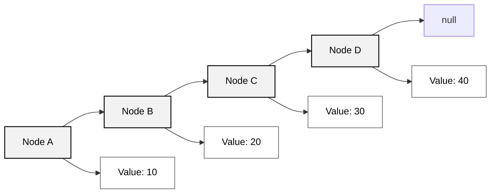
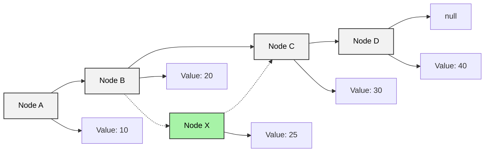
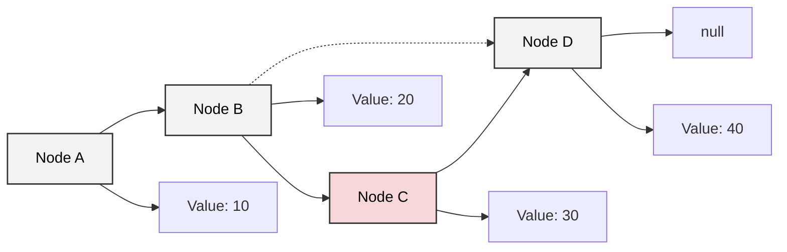

線性串列是數學理論應用在電腦科學中一種簡單與基本的資料結構，這一範疇包含了陣列與鏈結串列兩種主要的實作方式。  
一般來說，如果線性串列是 `n` 個元素組成的有限序列 (`n > 0`)，那其表示式為 `(a1, a2, a3, ..., an)`。

那線性串列應用在電腦資料儲存結構中可以分為兩種：
1. 靜態資料結構，又稱**密集串列**，指的其實就是陣列 (Array)。其特性為將有序的資料，使用連續記憶體空間儲存。因此在建立初期就需要先宣告最大可能的固定記憶體空間。
    - 優勢：設計簡單，可以輕鬆讀取、修改串列中的任意元素 (透過索引值)。
    - 劣勢：插入與刪除元素時，需要搬移大量元素，易造成記憶體浪費。
2. 動態資料結構，又稱**鏈結串列** (Linked List)。其特性為將有序的資料，使用不連續記憶體空間儲存。動態資料結構的記憶體配置是在執行時才發生，所以不需要事先宣告記憶體空間大小。
    - 優勢：插入與刪除元素時，只需調整指標 (Pointer) 即可，不需要搬移其他元素，節省時間與空間。
    - 劣勢：設計較為複雜，無法直接存取任意元素 (只能從頭節點開始逐一遍歷)。

## 陣列 (Array)
陣列是線性資料結構，其將**相同的資料型別**元素儲存在連續的記憶體空間中。  
而元素在陣列中的位置稱作**索引值** (Index)，通常從 `0` 開始編號。

陣列又有三種類型：

| 類型 | 語法範例 | 說明 | 生活化例子 |
|------|-----------|------|-------------|
| 一維陣列 (1D Array) | `int[] numbers = {1, 2, 3, 4, 5};` | 最基本的陣列形式，元素排成一列。可以想成一排座位，每個位置放一個資料。 | 一整排學生的座號：`[1, 2, 3, 4, 5]` |
| 二維陣列 (2D Array) | `int[][] matrix = {{1, 2}, {3, 4}};` | 元素排列成表格或矩陣，有「行」與「列」的概念。 | 教室座位表（2 行 2 列）：<br/>`[ [1, 2], [3, 4] ]` |
| 多維陣列 (Multi-dimensional Array) | `int[][][] cube = {{{1}, {2}}, {{3}, {4}}};` | 超過兩個維度的陣列，可以想成堆疊起來的立體結構。 | 多間教室的座位表（每間都有 2x2 座位）：<br/>`[ [ [1], [2] ], [ [3], [4] ] ]` |


### 新增、插入元素
陣列元素在記憶體的儲存是連續的，所以之間無空間再存放新元素。  
若要在陣列中間插入新元素，必須將插入位置後的所有元素往後移動一個位置，然後再將新元素放入指定位置。  
但因為陣列大小是固定的，所以加入元素必定會導致**該陣列尾部的元素遺失**。

```java
import java.util.Arrays;

public class ArrayBasics {
    public static void main(String[] args) {
        int[] arr = {0, 1, 2, 3, 4};

        // 走訪
        for (int element : arr) {
            System.out.print(element + " ");
        }
        System.out.println(); // 輸出：0 1 2 3 4

        // 索引
        System.out.println(arr[2]); // 輸出：2

        // 查詢
        int target = 3;
        int foundIndex = -1;
        for (int i = 0; i < arr.length; i++) {
            if (arr[i] == target) {
                foundIndex = i;
                break;
            }
        }
        System.out.println(foundIndex); // 輸出：3

        // 新增（在 index=2 插入 99，固定長度 → 會覆蓋尾巴）
        int insertIndex = 2;
        int insertValue = 99;
        for (int i = arr.length - 1; i > insertIndex; i--) {
            arr[i] = arr[i - 1]; // 所有元素往右移一格
        }
        arr[insertIndex] = insertValue;
        System.out.println(Arrays.toString(arr)); // 輸出：[0, 1, 99, 2, 3]（4 被覆蓋）

        // 刪除（移除 index=2，固定長度 → 最後補 0）
        int deleteIndex = 2;
        for (int i = deleteIndex; i < arr.length - 1; i++) {
            arr[i] = arr[i + 1]; // 元素往左移一格
        }
        arr[arr.length - 1] = 0; // 補上預設值
        System.out.println(Arrays.toString(arr)); // 輸出：[0, 1, 2, 3, 0]
    }
}
```

## 鏈結串列 (Linked List)



```java
import java.util.LinkedList;

public class TaskQueueExample {
    public static void main(String[] args) {
        // 1. 建立 LinkedList 當作任務佇列
        LinkedList<String> tasks = new LinkedList<>();

        // 2. 加入任務
        tasks.add("備份資料庫");
        tasks.add("寄送通知信");
        tasks.add("產生報表");
        System.out.println("初始任務清單: " + tasks);

        // 3. 插入高優先權任務 (插到最前面)
        tasks.addFirst("緊急修復 Bug");
        System.out.println("加入高優先任務後: " + tasks);

        // 4. 插入低優先權任務 (插到最後)
        tasks.addLast("清理暫存檔");
        System.out.println("加入低優先任務後: " + tasks);

        // 5. 存取 / 檢查任務
        System.out.println("下一個要處理的任務: " + tasks.getFirst());
        System.out.println("最後一個任務: " + tasks.getLast());

        // 6. 更新某個任務內容
        tasks.set(2, "寄送 VIP 客戶通知信");
        System.out.println("更新任務後: " + tasks);

        // 7. 移除已完成任務
        tasks.removeFirst(); // 完成第一個任務
        tasks.remove("產生報表"); // 完成指定任務
        System.out.println("部分任務完成後: " + tasks);

        // 8. 遍歷剩餘任務
        System.out.println("剩餘任務清單:");
        for (String task : tasks) {
            System.out.println("- " + task);
        }
    }
}
```

### Insertion (插入)
Linked list 插入新資料的方式非常快速且簡單，只要將要插入的位置前一個節點的 next 指向新節點，然後將新節點的 next 指向原本的下一個節點即可。  
以下圖為例，假設我們要在節點 B 和 C 之間插入一個新節點 X，該 X 節點的值為 25，那麼只需要將 B 節點的 next 指向 X 節點，然後將 X 節點的 next 指向 C 節點即可。


### Deletion (刪除)
Linked list 刪除節點的方式同樣快速，只要將 **要刪除節點的前一個節點** 的 next 改成指向 **要刪除節點的下一個節點**，就能把該節點從鏈結串列中移除。  
以下圖為例，假設我們要刪除節點 C，只需要將 B 節點的 next 改為指向 D 節點，這樣節點 C 就會被跳過，不再存在於鏈結串列中。  



## Array vs Linked List — CRUD 時間複雜度比較

### 理論版 (純 Big-O 定義)

| 資料結構     | 存取 (Access) | 搜尋 (Search) | 插入 (Insert) | 刪除 (Delete) |
|--------------|---------------|---------------|---------------|---------------|
| Array        | O(1)          | O(n)          | O(n)          | O(n)          |
| Linked List  | O(n)          | O(n)          | O(1)          | O(1)          |


### 實務版 (更貼近程式實際情境)

| 資料結構     | 存取 (Access) | 搜尋 (Search) | 插入 (Insert) | 刪除 (Delete) |
|--------------|---------------|---------------|---------------|---------------|
| Array        | O(1)          | O(n)          | O(n)          | O(n)          |
| Linked List  | O(n)          | O(n)          | O(1) / O(n) | O(1) / O(n) |

Linked list 的插入與刪除為 O(1) 的前提是「已經持有該節點的參考 (reference)」，只需調整指標即可。  
若未知插入位置的記憶體位置，即不知道他前後節點是誰時，則必須先搜尋，因為搜尋是 O(n)，所以插入也會變 O(n)。