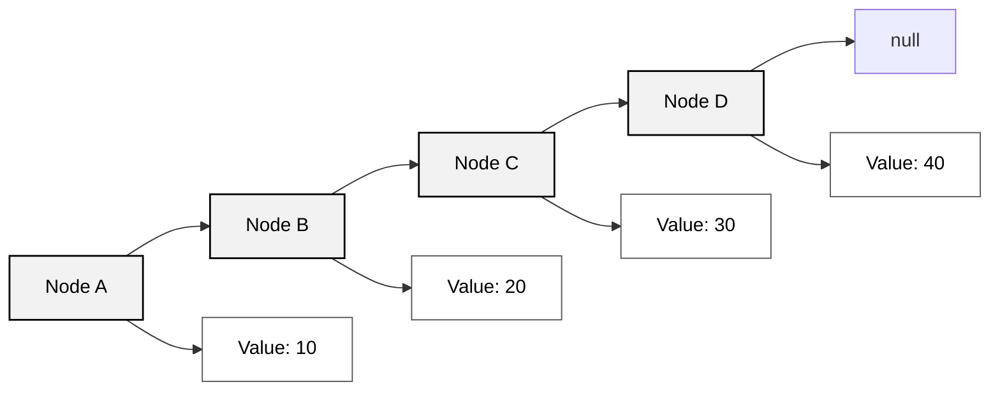
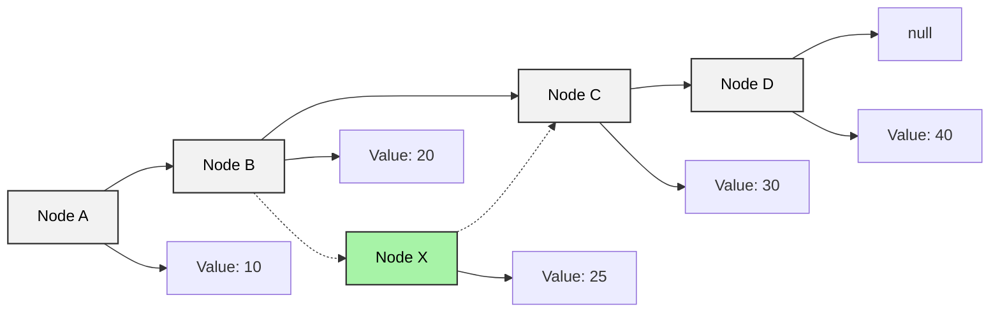
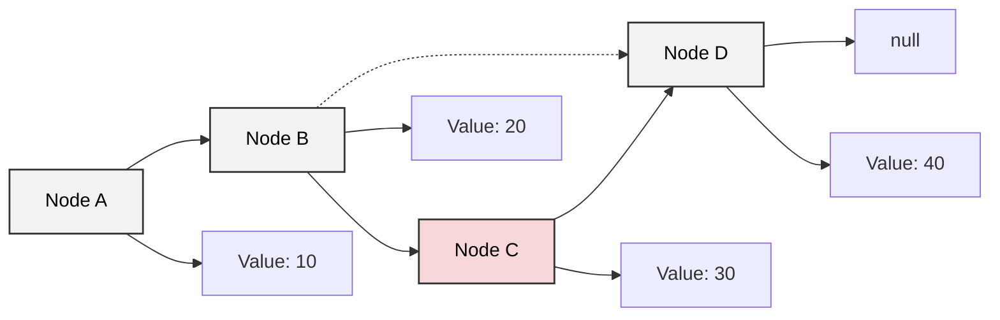

## 陣列 (Array)

```java
public class ArrayExamples {
    public static void main(String[] args) {

        // 1. 宣告並指定大小
        int[] numbers = new int[5]; // 預設值為 0
        numbers[0] = 10;
        numbers[1] = 20;

        // 2. 宣告並初始化
        int[] scores = {85, 90, 78};

        // 3. 使用 new + 初始化
        String[] fruits = new String[] {"蘋果", "香蕉", "橘子"};

        // 4. 多維陣列
        int[][] matrix = {
            {1, 2, 3},
            {4, 5, 6}
        };

        // 範例輸出
        System.out.println("numbers[0] = " + numbers[0]);
        System.out.println("scores[1] = " + scores[1]);
        System.out.println("fruits[2] = " + fruits[2]);
        System.out.println("matrix[1][2] = " + matrix[1][2]);
    }
}
```

## 鏈結串列 (Linked List)



```java
import java.util.LinkedList;

public class LinkedListExample {
    public static void main(String[] args) {

        // 1. 建立 LinkedList
        LinkedList<String> fruits = new LinkedList<>();

        // 2. 新增元素
        fruits.add("蘋果");
        fruits.add("香蕉");
        fruits.add("橘子");

        // 3. 在開頭或結尾新增
        fruits.addFirst("西瓜");
        fruits.addLast("葡萄");

        // 4. 取得元素
        System.out.println("第一個水果: " + fruits.getFirst());
        System.out.println("最後一個水果: " + fruits.getLast());

        // 5. 移除元素
        fruits.remove("香蕉");
        fruits.removeFirst();
        fruits.removeLast();

        // 6. 遍歷 LinkedList
        System.out.println("目前水果清單:");
        for (String fruit : fruits) {
            System.out.println(fruit);
        }
    }
}
```

### Insertion (插入)
Linked list 插入新資料的方式非常快速且簡單，只要將要插入的位置前一個節點的 next 指向新節點，然後將新節點的 next 指向原本的下一個節點即可。  
以下圖為例，假設我們要在節點 B 和 C 之間插入一個新節點 X，該 X 節點的值為 25，那麼只需要將 B 節點的 next 指向 X 節點，然後將 X 節點的 next 指向 C 節點即可。


### Deletion (刪除)
Linked list 刪除節點的方式同樣快速，只要將 **要刪除節點的前一個節點** 的 next 改成指向 **要刪除節點的下一個節點**，就能把該節點從鏈結串列中移除。  
以下圖為例，假設我們要刪除節點 C，只需要將 B 節點的 next 改為指向 D 節點，這樣節點 C 就會被跳過，不再存在於鏈結串列中。  



## Array vs Linked List — CRUD 時間複雜度比較

### 理論版 (純 Big-O 定義)

| 資料結構     | 存取 (Access) | 搜尋 (Search) | 插入 (Insert) | 刪除 (Delete) |
|--------------|---------------|---------------|---------------|---------------|
| Array        | O(1)          | O(n)          | O(n)          | O(n)          |
| Linked List  | O(n)          | O(n)          | O(1)          | O(1)          |


### 實務版 (更貼近程式實際情境)

| 資料結構     | 存取 (Access) | 搜尋 (Search) | 插入 (Insert) | 刪除 (Delete) |
|--------------|---------------|---------------|---------------|---------------|
| Array        | O(1)          | O(n)          | O(n)          | O(n)          |
| Linked List  | O(n)          | O(n)          | O(1) / O(n) | O(1) / O(n) |

Linked list 的插入與刪除為 O(1) 的前提是「已經持有該節點的參考 (reference)」，只需調整指標即可。  
若未知插入位置的記憶體位置，即不知道他前後節點是誰時，則必須先搜尋，因為搜尋是 O(n)，所以插入也會變 O(n)。