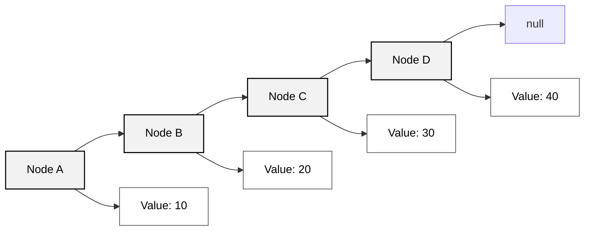
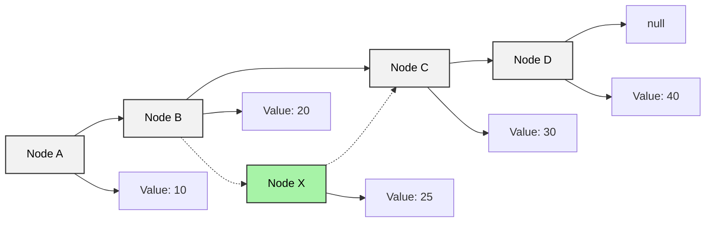
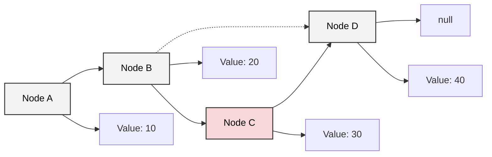

線性串列是數學理論應用在電腦科學中一種簡單與基本的資料結構，這一範疇包含了陣列與鏈結串列兩種主要的實作方式。  
一般來說，如果線性串列是 `n` 個元素組成的有限序列 (`n > 0`)，那其表示式為 `(a1, a2, a3, ..., an)`。

那線性串列應用在電腦資料儲存結構中可以分為兩種：
1. 靜態資料結構，又稱**密集串列**，指的其實就是陣列 (Array)。其特性為將有序的資料，使用連續記憶體空間儲存。因此在建立初期就需要先宣告最大可能的固定記憶體空間。
    - 優勢：設計簡單，可以輕鬆讀取、修改串列中的任意元素 (透過索引值)。
    - 劣勢：插入與刪除元素時，需要搬移大量元素，易造成記憶體浪費。
2. 動態資料結構，又稱**鏈結串列** (Linked List)。其特性為將有序的資料，使用不連續記憶體空間儲存。動態資料結構的記憶體配置是在執行時才發生，所以不需要事先宣告記憶體空間大小。
    - 優勢：插入與刪除元素時，只需調整指標 (Pointer) 即可，不需要搬移其他元素，節省時間與空間。
    - 劣勢：設計較為複雜，無法直接存取任意元素 (只能從頭節點開始逐一遍歷)。

## 陣列 (Array)
陣列是線性資料結構，其將**相同的資料型別**元素儲存在連續的記憶體空間中。  
而元素在陣列中的位置稱作**索引值** (Index)，通常從 `0` 開始編號。

陣列又有三種類型：

| 類型 | 語法範例 | 說明 | 生活化例子 |
|------|-----------|------|-------------|
| 一維陣列 (1D Array) | `int[] numbers = {1, 2, 3, 4, 5};` | 最基本的陣列形式，元素排成一列。可以想成一排座位，每個位置放一個資料。 | 一整排學生的座號：`[1, 2, 3, 4, 5]` |
| 二維陣列 (2D Array) | `int[][] matrix = {{1, 2}, {3, 4}};` | 元素排列成表格或矩陣，有「行」與「列」的概念。 | 教室座位表（2 行 2 列）：<br/>`[ [1, 2], [3, 4] ]` |
| 多維陣列 (Multi-dimensional Array) | `int[][][] cube = {{{1}, {2}}, {{3}, {4}}};` | 超過兩個維度的陣列，可以想成堆疊起來的立體結構。 | 多間教室的座位表（每間都有 2x2 座位）：<br/>`[ [ [1], [2] ], [ [3], [4] ] ]` |

### 走訪、隨機走訪元素
```java
import java.util.concurrent.ThreadLocalRandom;

public class arrayVisit {
    public static void main(String[] args) {
        int[] arr = {1, 3, 2, 5, 4};

        // 原始陣列
        System.out.print("Original array's element: ");

        // 遍歷走訪
        readArr(arr);

        // 隨機走訪
        randomNum(arr);
    }

    // 遍歷讀陣列
    static void readArr(int[] arr) {
        int arrSum = 0;

        for (int i = 0; i < arr.length; i++) {
            if (i == arr.length - 1) {
                System.out.print(arr[i]);
            } else {
                System.out.print(arr[i] + ", ");
            }

            arrSum += arr[i];
        }

        System.out.println();
        System.out.println("Array sum is: " + arrSum);
    }

    // 隨機走訪
    static void randomNum(int[] arr) {
        ThreadLocalRandom tlr = ThreadLocalRandom.current();
        int randomNum = tlr.nextInt(arr.length);
        System.out.println("Random visit: " + arr[randomNum]);
    }
}
```

### 新增、插入元素
陣列元素在記憶體的儲存是連續的，所以之間無空間再存放新元素。  
若要在陣列中間插入新元素，必須將插入位置後的所有元素往後移動一個位置，然後再將新元素放入指定位置。  
但因為陣列大小是固定的，所以加入元素必定會導致**該陣列尾部的元素遺失**。

```java
public class arrayInsert {
    public static void main(String[] args) {
        int[] arr = {1, 3, 2, 5, 4};

        // 原始陣列
        System.out.print("Original array's element: ");
        readArr(arr);

        // 插入元素
        insertNum(arr, 9, 2); // [1, 3, 9, 2, 5]
    }

    // 遍歷讀陣列
    static void readArr(int[] arr) {
        for (int i = 0; i < arr.length; i++) {
            if (i == arr.length - 1) {
                System.out.print(arr[i]);
            } else {
                System.out.print(arr[i] + ", ");
            }
        }
        System.out.println();
    }

    // 插入元素
    static void insertNum(int[] arr, int value, int index) {
        for (int i = arr.length - 1; i > index; i--) {
            arr[i] = arr[i - 1];
        }
        arr[index] = value;
        System.out.print("Array after inserted: ");
        readArr(arr);
    }
}
```

### 刪除元素
如果想刪除索引 `i` 位置，則需把索引 `i` 之後的所有元素往前移動一個位置，最後一個元素則會重複倒數第二個元素的值。

```java
public class arrayDelete {
    public static void main(String[] args) {
        int[] arr = {1, 3, 2, 5, 4};

        // 原始陣列
        System.out.print("Original array's element: ");
        readArr(arr);

        // 刪除元素
        deleteNum(arr, 2); // [1, 3, 5, 4, 4]

    }

    // 遍歷讀陣列
    static void readArr(int[] arr) {
        for (int i = 0; i < arr.length; i++) {
            if (i == arr.length - 1) {
                System.out.print(arr[i]);
            } else {
                System.out.print(arr[i] + ", ");
            }
        }
        System.out.println();
    }

    // 刪除元素
    static  void deleteNum(int[] arr, int index){
        for (int i = index; i < arr.length - 1; i++) {
            arr[i] = arr[i + 1];
        }
        System.out.print("Array after deleted: ");
        readArr(arr);
    }
}
```

:::info
總結陣列的 insert 與 delete 有以下特點，或者說缺點：
1. 時間複雜度高：插入與刪除的平均時間複雜度為 `O(n)`，`n` 為陣列長度。因為需要移動大量元素，當陣列很大時，這會導致效能瓶頸。
2. 丟失元素：因為陣列長度不可變，所以插入元素會超出陣列長度，導致陣列尾部的元素遺失。
3. 記憶體浪費：陣列元素變動時並無法改變陣列大小，若一開始宣告過大，會浪費記憶體空間。
:::

### 尋找元素位置
陣列因為是線性結構，所以陣列的查詢又稱為線性搜尋 (Linear Search)，需要從頭到尾逐一比對每個元素，直到找到目標元素或搜尋完整個陣列為止。

```java
public class arraySearch {
    public static void main(String[] args) {
        int[] arr = {1, 3, 2, 5, 4};

        // 原始陣列
        System.out.print("Original array's element: ");
        readArr(arr);

        // 搜尋存在的元素
        searchNum(arr, 5);
        // 搜尋不存在的元素
        searchNum(arr, 9);
    }

    // 遍歷讀陣列
    static void readArr(int[] arr) {
        for (int i = 0; i < arr.length; i++) {
            if (i == arr.length - 1) {
                System.out.print(arr[i]);
            } else {
                System.out.print(arr[i] + ", ");
            }
        }
        System.out.println();
    }

    // 查詢目標位置
    static void searchNum(int[] arr, int value) {
        int targetIndex = -1;
        for (int i = 0; i < arr.length; i++) {
            if (arr[i] == value) {
                targetIndex = i;
                break;
            }
        }

        if (targetIndex == -1) {
            System.out.println("Cannot find index of value");
        } else {
            System.out.println("Find the index of value " + value + " is: " + targetIndex);
        }
    }
}
```

### 陣列擴充
雖說陣列長度不可變，但可以透過建立一個更大的新陣列，然後將舊陣列的元素依序複製過去，來達到擴充陣列的目的。  
因為這樣依序複製的手法跟走訪的邏輯類似，所以時間複雜度也是 `O(n)`。

```java
import java.util.Arrays;

public class arrayExtend {
    public static void main(String[] args) {
        int[] arr = {1, 3, 2, 5, 4};

        // 原始陣列
        System.out.print("Original array's element: ");
        readArr(arr);

        // 不使用 copyOf 的擴充
        extendArrWithoutCopyOf(arr, 5);

        // 擴充陣列並新增元素
        extendArr(arr, 9, 2, 3);
    }

    // 遍歷讀陣列
    static void readArr(int[] arr) {
        for (int i = 0; i < arr.length; i++) {
            if (i == arr.length - 1) {
                System.out.print(arr[i]);
            } else {
                System.out.print(arr[i] + ", ");
            }
        }
        System.out.println();
    }

    // 擴充陣列 & 新增元素
    static  int[] extendArr(int[] arr, int value, int index, int large){
        arr = Arrays.copyOf(arr, arr.length + large);
        for (int i = arr.length - 1; i > index; i--) {
            arr[i] = arr[i - 1];
        }
        arr[index] = value;
        System.out.print("Array after expanded: ");
        readArr(arr);

        return arr;
    }

    // 不用 copyOf 的擴充
    static void extendArrWithoutCopyOf(int[] arr, int large) {
        int[] newArr = new int[arr.length + large];
        for (int i = 0; i < arr.length; i++) {
            newArr[i] = arr[i];
        }

        readArr(newArr);
    }
}
```

### 陣列的優缺點
1. 優點
    - 空間效率高：陣列在記憶體中是連續分配的，這使得陣列在存取元素時非常高效，因為可以透過索引直接定位到元素的位置。
    - 可以隨機訪問：陣列允許透過索引值直接存取任意位置的元素，這使得讀取和修改元素的操作非常快速，時間複雜度為 O(1)。
    - 快取區域性：由於陣列的元素在記憶體中是連續存放的，所以可以快速取得相鄰元素。
2. 缺點
    - 固定大小：陣列的大小在宣告時就必須確定，無法動態調整，這可能導致記憶體浪費或不足。
    - 插入與刪除效率低：在陣列中插入或刪除元素需要移動其他元素，時間複雜度為 O(n)，這在處理大量資料時可能會導致效能問題。

所以從陣列的優缺點可以看出，陣列除了讀取與修改特定 index 的元素為 `O(1)`，其他像是插入、刪除、搜尋等操作都需要 `O(n)` 的時間複雜度。  
所以陣列這種資料結構比較適合「已知資料長度，且讀取頻繁、修改 (插入、刪除) 較少」的應用場景，所以特別常被用來存放常數型資料 (constant data)，主要用途是查詢或讀取特定位置資料，而非頻繁更新資料。  
這類情景在生活上的例子包括：
1. 遊戲裡的玩家排行榜 → 通常會固定顯示前 N 名玩家，且主要操作是讀取排名。
2. 學生成績單 → 成績單通常有固定的科目數量，讀取成績的頻率較高。

或是存取一些已知長度的資料，如：
1. 一週七天的天氣預報 → 每週有固定的七天，主要操作是查詢每天的天氣狀況。
2. 一年 12 個月的星座 → 這也是固定的 12 個星座，主要操作是查詢某個月份對應的星座。

舉一個簡單例子來說，金融機構可以用陣列來存放「今日的各種幣別匯率」。  
因為這些匯率資料的筆數是固定的（例如僅有 5 種主要貨幣），而主要操作是查詢特定幣別的匯率，並非頻繁地更新或刪除。  
因此，用陣列來儲存與查詢這類固定資料是相當合適的作法。

```java
public class ExchangeRate {
    public static void main(String[] args) {
        // 幣別與對應匯率（以新台幣為基準）
        String[] currencies = {"USD", "JPY", "EUR", "KRW", "GBP"};
        double[] rates = {32.1, 0.22, 34.8, 0.024, 40.5}; // 匯率表

        String target = "EUR"; // 想查詢的幣別
        double amount = 100;   // 欲換匯的金額（例如 100 新台幣）

        boolean found = false;
        for (int i = 0; i < currencies.length; i++) {
            if (currencies[i].equals(target)) {
                double result = amount / rates[i];
                System.out.println(amount + " TWD 可兌換成 " + result + " " + target);
                found = true;
                break;
            }
        }

        if (!found) {
            System.out.println("查無幣別：" + target);
        }
    }
}
```

## 鏈結串列 (Linked List)



```java
import java.util.LinkedList;

public class TaskQueueExample {
    public static void main(String[] args) {
        // 1. 建立 LinkedList 當作任務佇列
        LinkedList<String> tasks = new LinkedList<>();

        // 2. 加入任務
        tasks.add("備份資料庫");
        tasks.add("寄送通知信");
        tasks.add("產生報表");
        System.out.println("初始任務清單: " + tasks);

        // 3. 插入高優先權任務 (插到最前面)
        tasks.addFirst("緊急修復 Bug");
        System.out.println("加入高優先任務後: " + tasks);

        // 4. 插入低優先權任務 (插到最後)
        tasks.addLast("清理暫存檔");
        System.out.println("加入低優先任務後: " + tasks);

        // 5. 存取 / 檢查任務
        System.out.println("下一個要處理的任務: " + tasks.getFirst());
        System.out.println("最後一個任務: " + tasks.getLast());

        // 6. 更新某個任務內容
        tasks.set(2, "寄送 VIP 客戶通知信");
        System.out.println("更新任務後: " + tasks);

        // 7. 移除已完成任務
        tasks.removeFirst(); // 完成第一個任務
        tasks.remove("產生報表"); // 完成指定任務
        System.out.println("部分任務完成後: " + tasks);

        // 8. 遍歷剩餘任務
        System.out.println("剩餘任務清單:");
        for (String task : tasks) {
            System.out.println("- " + task);
        }
    }
}
```

### Insertion (插入)
Linked list 插入新資料的方式非常快速且簡單，只要將要插入的位置前一個節點的 next 指向新節點，然後將新節點的 next 指向原本的下一個節點即可。  
以下圖為例，假設我們要在節點 B 和 C 之間插入一個新節點 X，該 X 節點的值為 25，那麼只需要將 B 節點的 next 指向 X 節點，然後將 X 節點的 next 指向 C 節點即可。


### Deletion (刪除)
Linked list 刪除節點的方式同樣快速，只要將 **要刪除節點的前一個節點** 的 next 改成指向 **要刪除節點的下一個節點**，就能把該節點從鏈結串列中移除。  
以下圖為例，假設我們要刪除節點 C，只需要將 B 節點的 next 改為指向 D 節點，這樣節點 C 就會被跳過，不再存在於鏈結串列中。  



## Array vs Linked List — CRUD 時間複雜度比較

### 理論版 (純 Big-O 定義)

| 資料結構     | 存取 (Access) | 搜尋 (Search) | 插入 (Insert) | 刪除 (Delete) |
|--------------|---------------|---------------|---------------|---------------|
| Array        | O(1)          | O(n)          | O(n)          | O(n)          |
| Linked List  | O(n)          | O(n)          | O(1)          | O(1)          |


### 實務版 (更貼近程式實際情境)

| 資料結構     | 存取 (Access) | 搜尋 (Search) | 插入 (Insert) | 刪除 (Delete) |
|--------------|---------------|---------------|---------------|---------------|
| Array        | O(1)          | O(n)          | O(n)          | O(n)          |
| Linked List  | O(n)          | O(n)          | O(1) / O(n) | O(1) / O(n) |

Linked list 的插入與刪除為 O(1) 的前提是「已經持有該節點的參考 (reference)」，只需調整指標即可。  
若未知插入位置的記憶體位置，即不知道他前後節點是誰時，則必須先搜尋，因為搜尋是 O(n)，所以插入也會變 O(n)。