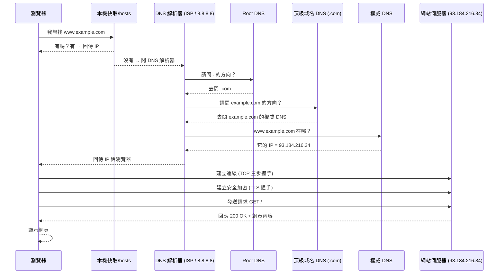
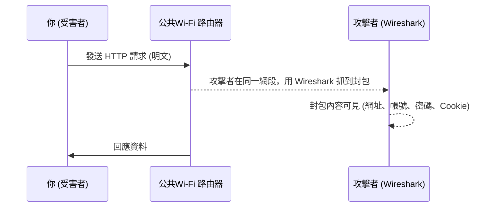

網路知識是前後端入門必學的一個章節，有時面試也會考。  
畢竟前後端的作品 - 網頁，就是這樣活在網路世界裡的。  
但說實在的，這些知識對於實際開發來說，一般不是那麼實用，但他大概就跟我們需要讀歷史一樣，對實際生活沒直接幫助，但能讓我們更了解這個世界的運作方式。  
整個網路的運作方式流程圖大概是這樣：

如果發現有些名詞陌生陌生的，沒關係，下節有名詞解釋。  
對照著流程圖看就可以對整個網路通訊流程有個大概的了解。

## 名詞解釋

### DNS 查詢階段 (找到伺服器 IP 為止)

| 名詞/節點 | 解釋 |
|-----------|------|
| 瀏覽器 | 使用者輸入網址的程式（Chrome、Firefox…），會先檢查快取，沒命中才向外查詢。 |
| 本機快取 / hosts | 電腦上的暫存紀錄或 hosts 檔，可直接記住網址對應的 IP，命中就不用對外查詢。 |
| 遞迴解析器 | 幫使用者代查 DNS 的伺服器（例如 ISP 提供的 DNS 或 8.8.8.8），一路詢問 Root、TLD、權威 DNS，直到找到最終 IP。 |
| Root DNS | DNS 系統的最上層，只告訴你「要查某個頂級域 (.com/.org/.tw) 應該問哪裡」。 |
| TLD DNS | 管理某個頂級域的伺服器，例如 `.com`，會告訴你「example.com 要去問哪個權威 DNS」。 |
| 權威 DNS | 網站的官方 DNS 伺服器，負責回覆最終的紀錄（A/AAAA → IP 位址，CNAME 等）。 |
| IP 地址 | 網路的數字地址（例如 93.184.216.34），就像門牌號碼，讓瀏覽器能找到正確的伺服器。 |
| ISP | 網路服務供應商，例如中華電信、遠傳，除了提供上網，也常提供預設的遞迴解析器。 |

### 連線與傳輸階段 (和伺服器建立通訊)

| 名詞/節點 | 解釋 |
|-----------|------|
| TCP | 傳輸控制協定，建立可靠連線，會先做「三向交握 (SYN → SYN-ACK → ACK)」確保雙方準備好再傳資料。 |
| TLS | 傳輸層安全協定，HTTPS 使用它來建立加密通道並驗證伺服器身份，確保傳輸安全。 |
| HTTP | 超文字傳輸協定，瀏覽器透過它向伺服器發送請求（GET），伺服器回應網頁內容（200 OK）。 |
| 伺服器 | 網站實際運行的主機，接收 HTTP 請求並回應 HTML、圖片、JS 等資料。 |

## 一些 murmur
在前面提到 XSS 那篇，曾經稍微提到過前端能做的資安防護其實不多，XSS 基本是最主要的網頁攻擊手法。  
那其他資安發生在哪裡？  
其實一大部分就是網路通訊階段的各個流程中。  
而這環節是前端比較難涉入的，一般公司也都會有專門的部門來處理這些事。  
但網路知識還是很重要，至少身為一個前端 (or 後端)，你要稍微知道自己的產品會如何活在這個世界上。

最後說一下那些有名的發生在通訊階段的攻擊手法有哪些。  
| 攻擊手法 | 說明 |
|-----------|------|
| DDoS (Distributed Denial of Service) | 攻擊者透過大量電腦同時發送請求，把伺服器或網路資源塞爆，導致服務癱瘓。 |
| 中間人攻擊 (MITM, Man-in-the-Middle) | 攻擊者插在用戶與伺服器之間，竊聽或竄改傳輸內容，常見於不安全的 Wi-Fi。 |
| DNS Spoofing / Cache Poisoning | 偽造 DNS 回應，讓使用者被導向惡意網站，而不是正確伺服器。 |

然後再提一嘴。  
一些工程師會告訴你不要連 public wifi，因為不安全，這是有依據的。  
網路真的沒你想像中安全，攻擊者其實只要跟你連結同一個 wifi，就有機會攔截你的通訊，包括你 POST 的資料、GET 拿到的東西，不知不覺你輸入的帳密等個人資訊可能就這樣被偷偷拿走了。  
所以這也是為什麼網路那麼多賣 VPN 的廣告，因為多一層 VPN 加密，的確能一定程度多上一層保障 (但我沒叫你一定要買 VPN 喔，我就沒買，養成良好的網路使用習慣才是真的)。  
然後這類攻擊其實比你想像得更容易發生，有個軟體叫 [Wireshark](https://www.wireshark.org/download.html)，就可以讓人輕易嗅探未加密得 wifi 環境裡的封包，而這個軟體是誰都可以載的。  
不過如果網站有導入 HTTPS，就算在公共 Wi-Fi 上也能避免大多數嗅探，攻擊者抓到的也只是加密後的封包。  
所以要養成良好的網路使用習慣，比如只去 HTTPS 網站、避免在公共 wifi 上輸入敏感資訊，就能大幅降低風險。

